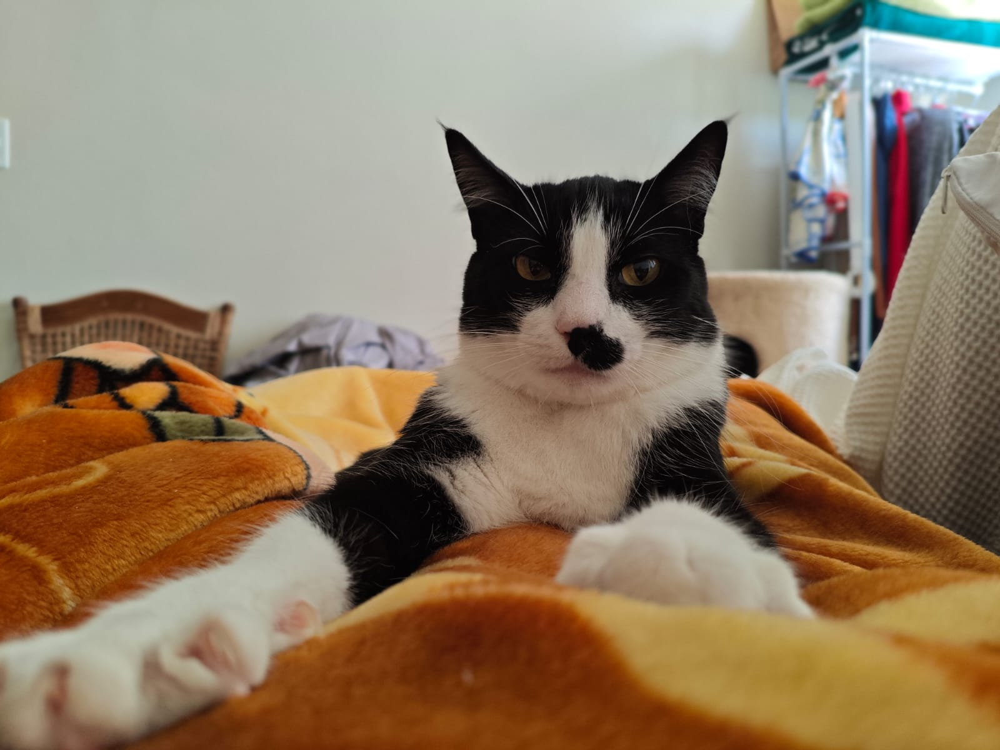

A project inspired by Carlo's [Pixless Camera](https://www.kickstarter.com/projects/carloandreini/pixless-camera), make sure to check it out and back his project! (Dude’s got the best name 🙂)

You can customize the following properties:

*   Width of the final image
*   Palette size (number of colors to quantize to - if not using a predefined palette)
*   Pixel scale (for integer scaling, magnify x times)
*   Brightness Factor (increase brightness or not)
*   Contrast Factor (increase contrast or not)
*   Palette (specified by a txt file, check examples in the “palettes” folder)

Sample images:

---

"Digital Paper" palette

 

---

"Oil" palette

 

---

"Rust Gold" palette


 

---

No palette defined


 

---

Sample video

<video src="samples/sample_video.mp4" width="400" type="video/mp4" controls></video> <video src="samples/sample_video_output.mp4" width="400" type="video/mp4" controls></video>
 

---

All palette files included in the repository were collected from the [lospec](https://lospec.com/palette-list) website.

```python
# Example usage
input_image_path = "my_image.jpg"  # Replace with the path to your input image
output_image_path = f"{input_image_path.split('.')[0]}_pixelated.png"  # Replace with the path to save the output
palette_file_path = "palettes/oil-6.txt"  # Replace with the path to your palette file (optional)

pixelate_image(
    input_path=input_image_path,
    output_path=output_image_path,
    target_width=256,
    palette_size=4,
    pixel_scale=4,
    brightness_factor=1.0,          # Increase brightness by 20%
    contrast_factor=1.5,            # Increase contrast by 10%
    palette_file=palette_file_path  # Optional: Path to a custom palette file
)

# Example usage
input_video_path = "my_video.mp4"  # Replace with the path to your input image
output_video_path = f"{input_image_path.split('.')[0]}_pixelated.mp4"  # Replace with the path to save the output
palette_file_path = "palettes/oil-6.txt"  # Replace with the path to your palette file (optional)

pixelate_video(
    input_path=input_video_path,
    output_path=output_video_path,
    target_width=256,
    palette_size=4,
    pixel_scale=8,
    brightness_factor=1.0,
    contrast_factor=1.5,
    palette_file=palette_file_path,
    fps=30
)
```
